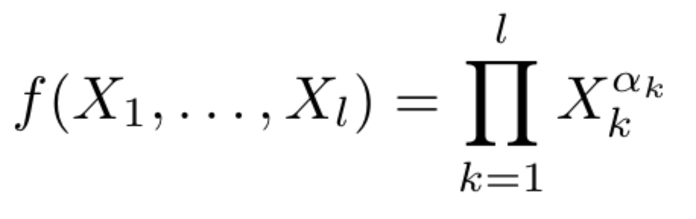
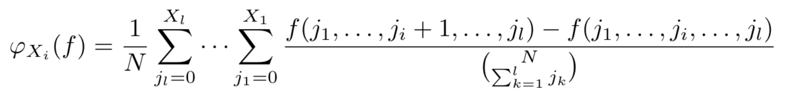

# What are the Shapley values of the factors in a production function?
I derived the formula and then wrote code for computing the Shapley values for a user-specified production function. For now, the production function must fit the following form:

The user specifies the number of factors  
, the current values of each factor $X_k$, and each exponent $\alpha_k$. The Shapley value for factor $X_i$ is then:

